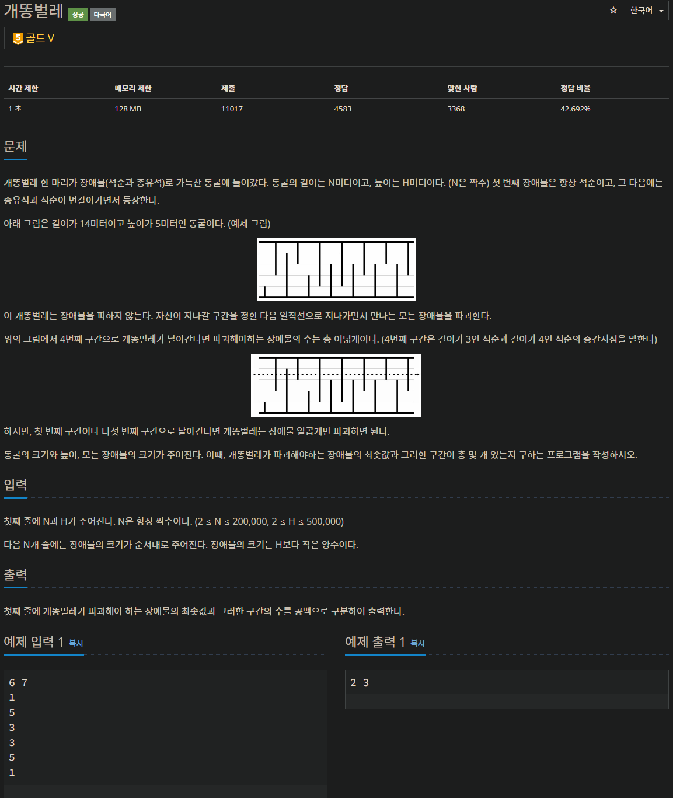

# BOJ 3020 : 개똥벌레

---
### 문제 요약
시간 : 1초   
석순, 종유석의 길이가 순서대로 주어진 배열에서, 높이가 H인 위치에 직선을 그었을 떄, 석순, 종유석과 만나는 부분의 합의 최솟값을 구하고, 최솟값을 가지는 직선의 갯수를 구하여라.

---
### 문제 풀이
#### 사용한 알고리즘 : 정렬, 이분탐색
그렇게 생각한 이유 : 시간 제한이 1초이고, 높이 제한이 500000 이므로, O(N) 또는 O(NlogN)을 이용해야한다. 직선의 높이가 변할때 마다 최솟값인지 아닌지 판별해주어야 하므로, 최솟값을 구할 때 O(log n)으로 구해야 하므로, 이분탐색을 사용한다.
#### 구현
1. 석순, 종유석을 각각 down, up 배열에 저장하고, 정렬한다.
2. 직선의 높이를 기준으로, 직선의 높이보다 석순의 길이가 크다면, 만나는 점이라고 판단한다.
3. 직선과 만나는 석순 중 가장 높이가 작은 석순의 index를 구하고, 전체 석순의 개수에서 그 석순의 index를 빼준다면, 직선과 만나는 석순의 개수와 동일하다.
4. 같은 방식으로 종유석과 직선이 만나는 점의 갯수를 구한다.
5. 직선의 높이가 1부터 주어진 H까지 변할 때, <직선>과 <석순, 종유석>이 만나는 점의 합의 최솟값을 갱신하며, 최솟값이 여러개라면, count를 세준다.

---
### 전체 코드
    import sys
    input = sys.stdin.readline
    
    N, H = map(int, input().split())
    up, down = [], []
    for i in range(N):
        if i%2:
            up.append(int(input()))
        else:
            down.append(int(input()))
    
    up.sort()
    down.sort()
    
    def binary_search(arr, target, left, right):
        while left <= right:
            mid = (left + right) // 2
            if arr[mid] < target:
                left = mid + 1
            else:
                right = mid - 1
    
        return left
    
    D, U = len(down), len(up)
    count_minimum = 0
    minimum = float('inf')
    for i in range(1, H+1):
        count_down = D - binary_search(down, i-0.5, 0, D-1)
        count_up = U - binary_search(up, H-i+0.5, 0, U-1)
    
        if count_down + count_up < minimum:
            minimum = count_down + count_up
            count_minimum = 1
    
        elif count_down + count_up == minimum:
            count_minimum += 1
    
    print(minimum, count_minimum)

