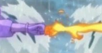

# 23634

## 미안하다 이거 보여주려고 어그로 끌었다

### 문제 요약

매 시간 한 칸씩 불이 퍼져 나가는데, 모든 불이 서로 만나는 순간의 시간과 불의 크기를 구하는 문제. 만약 모든 불이 만나지 못 한다면 만날 수 있는 모든 불이 만나는 순간의 시간의 불을 크기를 구해야함. (0: 불, 1: 나무, 2: 돌)

### ~~간단한~~ BFS

그래프를 트리탐색하여 순회하는 전형적인 문제. 

다만, 약간 까다로운데, “불이 만나는 순간”에서 “만난다”의 조건이 서로 다른곳에 있던 불이 한 cell에서 겹치는게 아니라, 두 불이 접하는 순간을 “만난다”로 정의되어 있음.

ex) ...0110... ⇒ ...0000... 이면 두 불은 1초 만에 만나게 됨.

⇒ 최종 시간 - 1 로 구현하게 될 경우 ...010... ⇒ ...000...의 경우는 또 다로 고려해줘야함.

1. 매 초 불이 퍼져나간다.
2. 불이 퍼져나갔을 때, 서로 만나면 합쳐줘야한다.
3. 모든 불이 합쳐지면 그 순간이 정답이다.
4. 1번으로 돌아간다

1. 서로 만난다 ⇒ bfs를 돌려서 불이 퍼져나간 뒤에, 퍼져나갔던 불 위에서 다시 4면을 보고 다른쪽에서 온 불이 있으면 merge해줘야한다. 

1. 합쳐줘야한다 ⇒ 처음부터 불의 그룹을 나눠주어야하고, 서로 만날 때 마다 그룹을 합쳐주면서 그룹이 하나가 되는지 확인해야한다. ⇒ 유니온파인드

1. 모든불이 합쳐지면 ⇒ 만약 모든 불이 합쳐질 수 없는 경우는 어떻게 판단해야하나? 

~~case 1) 입력 들어오면 합쳐질 수 없는 경우를 나누어서 생각~~

case 2) 판단하지말자.

서로 다른 두 불의 집합이 합쳐질 때 정답을 갱신해주자.

그러면, bfs이기 때문에 현재 갖고 있는 정답은 제일 마지막에 불이 합쳐질 때의 값.

모든 불이 합쳐질 수 없는 경우에도 최종적으로 합쳐진 값을 갖고 있기 때문에 문제 명세에 따라 정답.