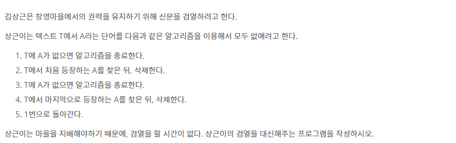

# 3111

## 문제

## 9935번 문자열폭ㅋ발

검열 문제와 다른 점

1. 앞에서만 삭제해나간다.
2. 모든 문자가 distinct하다.

stack하나를 두고, T의 문자를 하나하나 push해가면서 A의 index도 같이 push, 

A와 완전히 겹치면 전부 pop하는 과정을 반복.

## 생각보다 쉽다.

문자열 폭발 문제와 다른 점

1. 양쪽에서 삭제해나간다 ⇒ stack 2개 두자.

T에서 앞에서부터 stack1에 push하다가 A를 포함하면 전부 pop.

T에서 뒤에서부터 stack2에 push하다가 A를 포함하면 전부 pop.

만약 stack1에 T를 넣는데 그게 stack2에 이미 push된 문자라면? 또는 반대라면?

⇒ 반대편 stack의 pop해서 뺏어오면 된다. 

⇒ T를 deque로 관리하면 index를 l, r로 잡고 하는 짓을 안 해도 된다.

## 생각보다 어려운데요?

문자열 폭발 문제와 다른 점

1. 문자가 distinct하지 않다.

distinct할 경우 현재 상태를 A의 index로 정의할 수 있으므로 무지성 접근이 가능하다.

distinct하지 않으므로 현재 상태를 A의 index로 정의 시 현재 상태가 모호해진다.

예를 들어,

A : aab aab ab 이고 T: aab aab aab ab일 때 

aab aab a까지 만 겹치고, 그 다음 다시 a가 나오므로 상태를 앞 전 상태로 전이시켜주어야한다.

근데 aab aa로 갈 지, aa로 갈 지 결정해야하는데 할 수가 없다.

(aab aab aa는 aab aa와 aa를 모두 포함)

⇒ A가 25니 그냥 aabaa와 aa를 모두 저장해도 시간복잡도가 25밖에 늘어나지 않는다.

⇒ 가능한 모든 상태를 stack에 싹 다 집어넣어도 25밖에 늘어나지 않는다.

###