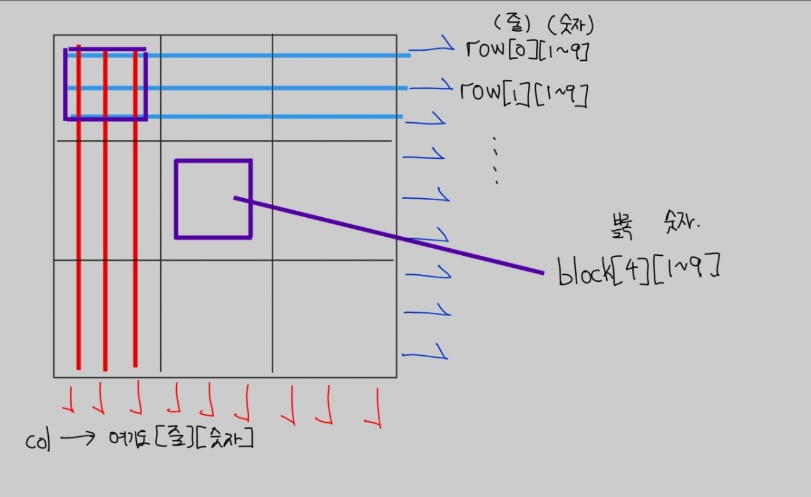

# 2580 스도쿠

## 모두가 잘아는 스도쿠 입니다.

<p> ?가 빈칸이고 스도쿠를 맞추는 문제입니다.

---

스도쿠를 맞추는데 
arr : 실제 스도쿠 저장<br/>
row : 가로 숫자 확인 용도<br/>
col : 세로 숫자 확인 용도<br/>
block : 한 블럭  확인 용도<br/>

square_num : 좌표[x,y]가 몇번 블럭에 속해있는지 확인<br/>

사용한 알고리즘 : DFS<br/>

screenshot


x,y라는 스도쿠의 좌표를 받을때<br/> 
**_zero_** 라는 pair<int,int> 벡터에 '?'가 나온곳의 좌표를 넣는다.<br/>
**_row_** 라는 배열에는 가로 x번째줄의 [1~9]를 체크한다.<br/>
**_col_** 라는 배열에는 세로 y번쨰 줄의 [1~9]를 체크한다.<br/>
**_block_** 라는 배열에는 블럭의 [1~9]를 체크한다.<br/>
```c++
if(arr[i][j] != 0){
                //row,col,block에 해당 숫자 true
                row[i][arr[i][j]] = col[j][arr[i][j]] = block[square_num(i,j)][arr[i][j]] = true;
            }
            else{
                //'?'라면 zero에 좌표 push_back
                zero.push_back({i,j});
                siz++;
            }
```
<br/>
스도쿠는 가로,세로,블럭이 다 1~9가 겹치면 안된다.<br/>
<br/>

**-> 따라서 zero의 [x,y] 라는 좌표에 숫자를 넣을 때  row[x][y],col[x][y],block[(x)][y]가 모두 false인지 확인, 모두 false라면 숫자를 넣고 다음 zero의 ?좌표를 확인한다**
(DFS조건)
<br/>

```c++
//모두 false인지 확인
if(row[x][i] == false && col[y][i] == false && block[square_num(x,y)][i] == false)
```

모두 false라면 해당 숫자에 모두 true를 체크하고 다음으로 넘어감

만약 zero의 마지막좌표를 넘어선다면 스도쿠가 완성됬으므로 종료


<br/>

---
코드
```c++
#include <bits/stdc++.h>
using namespace std;
int arr[10][10],siz;
bool row[10][10],col[10][10],block[10][10];
vector<pair<int,int>> zero;
int square_num(int i,int j){
    return (i/3)*3 + j/3;
}

bool dfs(int n){
    if(n == siz){print();return true;}
    int x = zero[n].first;
    int y = zero[n].second;
    for(int i=1;i<=9;i++){
        if(row[x][i] == false && col[y][i] == false && block[square_num(x,y)][i] == false){
            row[x][i] = col[y][i] = block[square_num(x,y)][i] = true;
            arr[x][y] = i;
            if(dfs(n+1)){return true;}
            row[x][i] = col[y][i] = block[square_num(x,y)][i] = false;
            arr[x][y] = 0;
        }
    }
    return false;
}

int main(){
    siz = 0;
    for(int i=0;i<9;i++){
        for(int j=0;j<9;j++){
            scanf("%d",&arr[i][j]);
            if(arr[i][j] != 0){
                row[i][arr[i][j]] = col[j][arr[i][j]] = block[square_num(i,j)][arr[i][j]] = true;
            }
            else{
                zero.push_back({i,j});
                siz++;
            }
        }
    }
    dfs(0);
    return 0;
}
```
