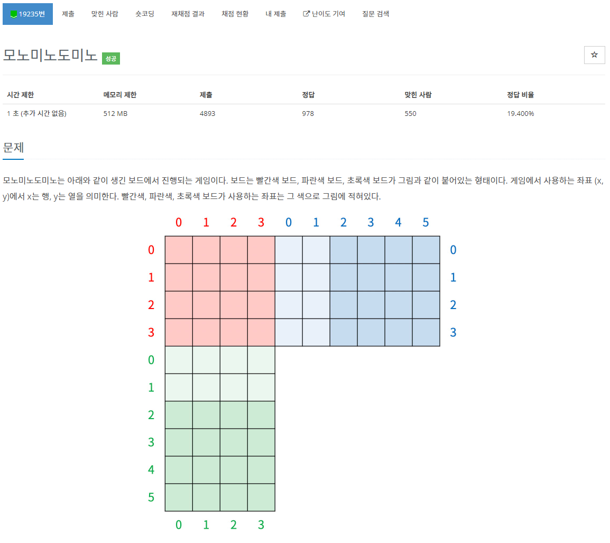

# 19235

# 모노미노도미노

### 문제 요약

위 그림과 같은 판에서 빨간 곳에 (1, 1), (2, 1), (1, 2)크기의 블록이 매번 들어온다. 빨간 곳에 놓여진 블록은 x축에 평행하게 오른쪽으로 쭉 옮겨져 파란 곳에 놓여진다. 또한, y축에 평행하게 아래로 쭉 옮겨져 초록색 영역에 놓여진다. 

각 영역에 테트리스처럼 쌓이는데, 규칙은 테트리스와 완전히 동일하다(초록색 영역에서는 가로줄이 꽉차면 한 줄이 사라지고, 파란색 영역에서는 세로줄이 꽉 차면 한줄이 사라진다). 매 줄이 사라질 때 마다 점수를 1점을 얻는다.

매번 블록이 쌓이고 테트리스 규칙대로 수행한 뒤에, 연한 초록 또는 연한 파란색의 영역에 블록이 놓여있을 경우, 연한 영역에 블록이 없어질 때 까지 강제로 가장 아랫줄을 한 줄 삭제하고 모든 줄을 한 줄씩 내린다. 이 때는 점수를 얻지 못 한다.

게임을 수행한 뒤에 얻은 점수와 파란색, 초록색영역에 있는 블럭의 수의 합을 출력하는 문제.

### 간단하게 만들기

굳이 초록색, 파란색 영역을 나눠서 구현할 필요가 없다. 초록색 부분만 구현한 뒤, 파란색 부분을 회전시켜서 초록색 부분과 동일하게 만들 수 있다.

((1,2) 블록은 (2,1)블록으로, (2, 1)블록은 (1,2)블록으로, X, Y좌표 서로 변경)

### 시뮬레이팅 순서 정하기

1. 블록을 원하는 위치에 놓는다.
2. 지울 수 있는 줄이 있으면 지운다.
3. 줄을 지웠다면, 모든 블록을 아래로 내린다.
4. 지울 수 있는 줄이 없을 때 까지 반복한다.
5. 연한 부분에 블록이 남아 있으면 맨 아랫줄을 지우고 내린다.
6. 입력 끝까지 반복한다.

