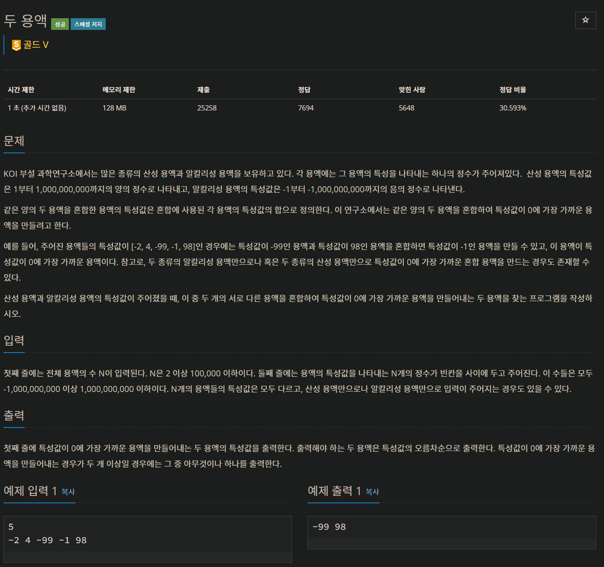

#BOJ 2470: 두 용액

---
###문제 요약
시간 : 1초   
길이가 N(2~100000)인 배열에서 두 숫자를 골라,     
두 숫자의 합이 0에 가장 근접한 쌍을 찾는다.
---
###문제 풀이
####사용한 알고리즘 : 정렬, 투포인터
그렇게 생각한 이유 : 시간이 1초이므로, 정렬 (nlogn)의 시간은 충분하다.
####구현
1. 주어진 배열을 정렬한다.

2. abs(array[leftindex] + array[rightindex]) 값을 구하며, 최솟값을 갱신하고, 왼쪽 값과, 오른쪽 값을 저장한다.

3. leftindex를 1만큼 늘리고, rightindex를 1만큼 줄이는 과정의 반복인데, 어떤 index를 늘리고 줄일지 결정해야 하는 것이 관건이다.

4. leftindex를 1만큼 늘렸을때의 합과, rightindex를 1만큼 줄였을 떄의 합을 비교하여, 더 합이 작은 쪽의 index를 건들여준다.

5. <2~4>번의 과정을 leftindex가 rightindex값보다 작을 동안 반복한다.

6. 갱신된 최솟값에서의 왼쪽 값과, 오른쪽 값이 답이다.
---
###전체 코드
    import sys
    input = sys.stdin.readline
    
    N = int(input())
    arr = list(map(int, input().split()))
    arr.sort()
    
    left, right = 0, N-1
    answer = float('INF')
    ans_left, ans_right = 0, 0
    
    while left < right:
    
        sub = abs(arr[left] + arr[right])
    
        if sub < answer:
            answer = sub
            ans_left = arr[left]
            ans_right = arr[right]
    
        if abs(arr[left+1] + arr[right]) < abs(arr[left] + arr[right-1]):
            left += 1
        else:
            right -= 1
    
    print(ans_left, ans_right)

